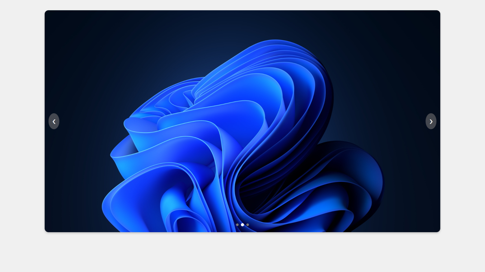
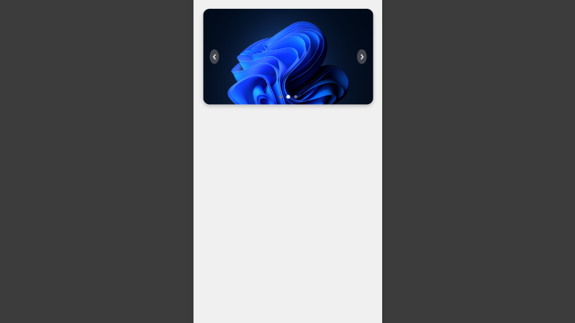

# 🖼️ JavaScript Dynamic Slider 

🚀 A **lightweight, responsive, and customizable slider** built using **HTML, CSS, and JavaScript**.  
It features **smooth transitions, navigation controls**, and **auto-play functionality**.  

## 🌟 Features  
✅ **Fully Responsive** – Adapts to different screen sizes 📱💻  
✅ **Smooth Transitions** – Enhances user experience 🎞️  
✅ **Navigation Controls** – Previous & next buttons for manual control ⏪⏩  
✅ **Auto-Play Mode** – Automatically cycles through images 🔄  
✅ **Easy Customization** – Modify styles, transition speed, and behavior 🎨  

---

## 📸 Preview  

### 🖥️ Desktop  
  

### 📱 Mobile  
  

The slider **automatically adjusts** to different screen sizes using **CSS media queries**.  

---

## 📂 Project Structure  
```
/javascript-dynamic-slider
│── /src/css/styles.css      # Styling for the slider  
│── /src/js/script.js        # JavaScript logic  
│── /src/images/             # Image assets  
│── index.html               # Main HTML file  
│── README.md                # Documentation  
│── favicon.ico              # Website icon  
```

---

## 🔧 Getting Started  

1️⃣ **Clone the repository:**  
```sh
git clone https://github.com/iqbolshoh/javascript-dynamic-slider.git
cd javascript-dynamic-slider
```

2️⃣ **Open the `index.html` file in your browser:**  
```sh
open index.html
```

---

## 🖥️ Technologies Used  

<div style="display: flex; flex-wrap: wrap; gap: 5px;">
    
    
    
</div>

---

## 🤝 Contributing  

🎯 Contributions are welcome! If you have suggestions or want to enhance the project, feel free to fork the repository and submit a pull request.

## 📬 Connect with Me  

💬 I love meeting new people and discussing tech, business, and creative ideas. Let’s connect! You can reach me on these platforms:

<div align="center">
    <table>
        <tr>
            <td>
                <a href="https://github.com/iqbolshoh">
                    
                </a>
            </td>
            <td>
                <a href="https://t.me/iqbolshoh_777">
                    
                </a>
            </td>
            <td>
                <a href="https://www.linkedin.com/in/iiqbolshoh/">
                    
                </a>
            </td>
            <td>
                <a href="https://instagram.com/iqbolshoh_777" target="blank">
                    
                </a>
            </td>
            <td>
                <a href="https://wa.me/qr/22PVFQSMQQX4F1">
                    
                </a>
            </td>
            <td>
                <a href="https://x.com/iqbolshoh_777">
                    
                </a>
            </td>
            <td>
                <a href="mailto:iilhomjonov777@gmail.com">
                    
                </a>
            </td>
        </tr>
    </table>
</div>
