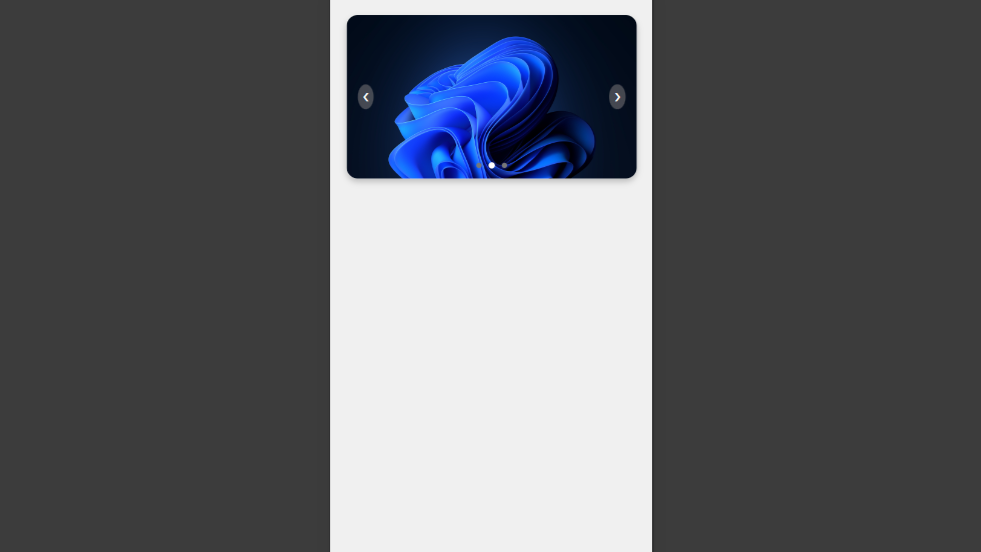

# JavaScript Slider Template

This project is a simple and responsive JavaScript slider template designed to work seamlessly across all devices. It features smooth transitions, navigation buttons, and customizable styles to fit various use cases.

## Overview

### Desktop 


### Mobile 



## Features

- Responsive design that adapts to various screen sizes, including mobile devices.
- Smooth transitions for slide changes.
- Navigation buttons for manual control of slides.
- Auto-play functionality with customizable interval time.

## Getting Started

To get started with this slider template, follow these steps:

1. **Clone the repository:**
   ```sh
   git clone https://github.com/iqbolshoh/template-javascript-slider.git
   cd template-javascript-slider
   ```

2. **Open the `index.html` file in your browser:**
   ```sh
   open index.html
   ```

## Responsive Design

This slider template is built to be responsive and works well on various screen sizes. The CSS media queries ensure that the slider adjusts its width and other properties based on the screen size.

## Contributing

Contributions are welcome! If you have suggestions or want to enhance the project, feel free to fork the repository and submit a pull request.

## Connect with Me

I love connecting with new people and exploring new opportunities. Feel free to reach out to me through any of the platforms below:

<table>
    <tr>
        <td>
            <a href="https://github.com/iqbolshoh">
                
            </a>
        </td>
        <td>
            <a href="https://t.me/iqbolshoh_777">
                
            </a>
        </td>
        <td>
            <a href="https://www.linkedin.com/in/iiqbolshoh/">
                
            </a>
        </td>
        <td>
            <a href="https://instagram.com/iqbolshoh_777" target="blank"></a>
        </td>
        <td>
            <a href="https://wa.me/qr/22PVFQSMQQX4F1">
                
            </a>
        </td>
        <td>
            <a href="https://x.com/iqbolshoh_777">
                
            </a>
        </td>
        <td>
            <a href="mailto:iilhomjonov777@gmail.com">
                
            </a>
        </td>
    </tr>
</table>

